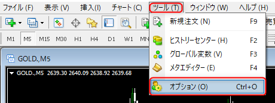
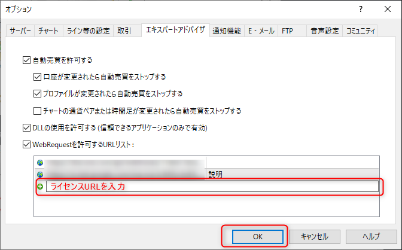
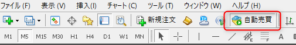
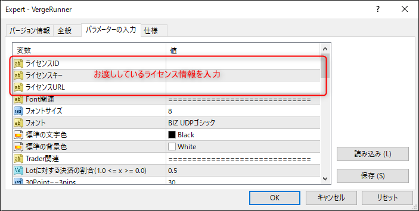
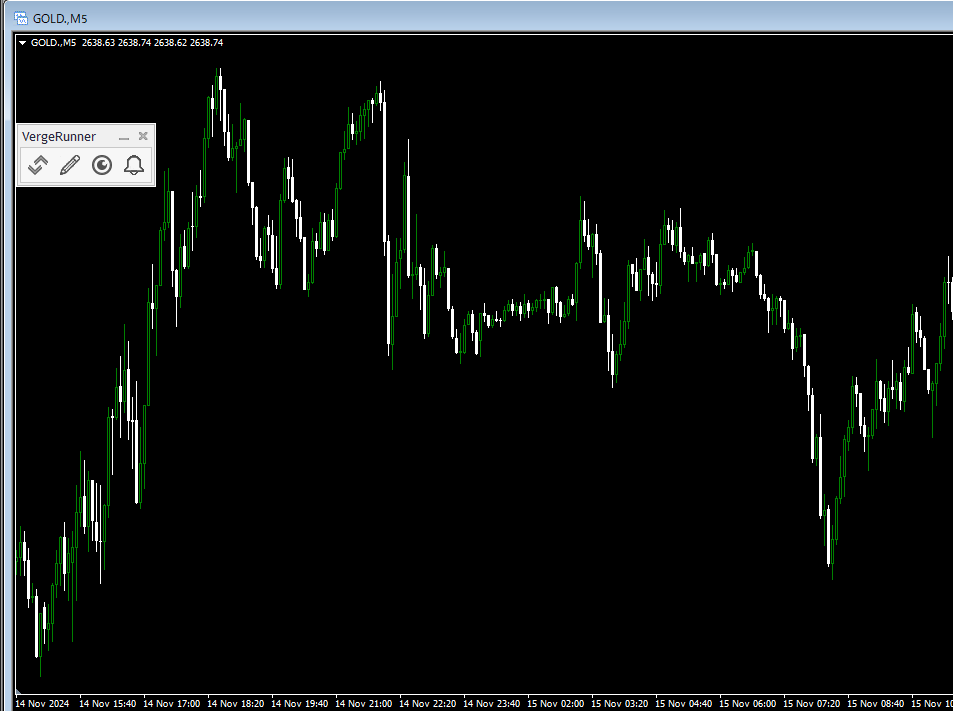

# ライセンス認証

!!! warning
    ライセンスに関する情報は大切に保管して下さい。  
    また、他者とのライセンス共有は決してされないようにお願い致します。

## ツール・オプションの設定
MT4のツールバーから ツール > オプション をクリック

オプションウィンドウが開きましたら、画像の３項目にチェックを入れて下さい。

次に**ライセンスURL**を「WebRequestを許可するURLリスト」に追加  
設定画完了しましたら、OKボタンを押します。

## EAの有効化

次に、自動売買ボタンを押してEAを有効にします。

## ライセンス認証

VergeRunnerを任意のチャートにドラッグアンドドロップまたはダブルクリックで配置します。  
設定ウィンドウが現れますので下記の設定を行います。

!!! tips
    設定内容は、「保存」ボタンから保存を行うことができます。  

## 起動確認

ライセンス認証を通過しますと、VergeRunnerのGUIが表示されます。

以上でインストールは完了です。

---