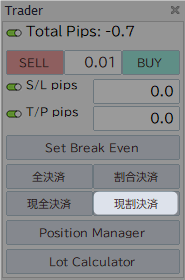
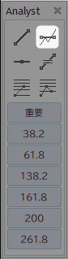
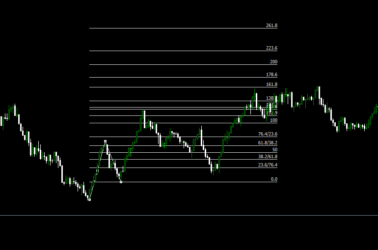

# 機能一覧

## Global

### ウィンドウサイズ調整

<video src="../_video\resizable_window.mp4" controls="true" width="600"></video>

## チャート情報

### 通貨ペア | 時間軸

チャートの右上に現在の**通貨ペア**や**時間軸**の情報を表示  
通貨ペアのみ、時間軸のみの表示も可能です。

## Pips情報

### Pips Label

ポジション毎のPipsをチャート上にラベルで表示
状態に応じて色が変化します。  
この機能を使用するにはTotalPipsを有効にする必要があります。

### Total Pips

すべてのPipsLabelの合計値を表示  
Offにすると、Labelが削除されます。

## Entry

### One Click Entry

入力したLotでSell・Buyのエントリーが行えます。

### StopLoss / TakeProfit

One Click Entryの際にSL/TPを設定する。  
SL/TPはそれぞれ有効状態でのみ機能します。

## Edit Position

### Set Break Even

すべてのポジションのSLを手数料を考慮した損益分岐点に移動  
含み益状態のポジションのみ実行されます。  
損益分岐点は個々のポジションで計算されます。  

## Exit

### 全決済

すべてのポジションを一括決済
約定前のポジションは対象外です。

### 割合決済

すべてのポジションを割合決済  
各ポジションのLotを設定された割合分、決済します。  
初期値は**0.5(50%)**で各ポジションのLotの半分を決済

### 現全決済

現在のチャートの通貨ペアのみ一括決済  
約定前のポジションは対象外です。

### 現割決済

現在のチャートの通貨ペアのみ割合決済  
各ポジションのLotを設定された割合分、決済します。  
初期値は**0.5(50%)**で各ポジションのLotの半分を決済

### Position Manager

約定済みのポジションを個別に全決済・割合決済することができます。

### Lot Calculator

各項目の数値から適切なLotを計算  
それらの値はTraderに自動的に入力されます。

### Trade Log Line

ポジションを決済した際に**EntryPoint**と**ExitPoint**を結ぶTrade Log Lineを描画
成績がわかりやすいように損益に応じて色を割り当てられます。

## チャートオブジェクトの描画
チャート分析において頻繁に使用されると想定したものを採用しています。  
描画をするには**オブジェクトに対応するボタン**または**ホットキー**を入力後、チャートをクリックするとその位置に描画されます。
<video src="../_video/draw_object.mp4" controls="true" width="600"></video>

また、**時間軸に応じた色を自動的に割り当て**ており、MTF分析においての視認性が向上します。  
<video src="../_video/line_color.mp4" controls="true" width="600"></video>

### トレンドライン
ホットキー:`T`  

### ネックライン
ホットキー:`N`  

### 水平ライン
ホットキー:`H`  

### 等倍
ホットキー:`A`  

### フィボナッチ リトレースメント
ホットキー:`F`  
フィボナッチレベルの編集方法については[こちら](manual/edit_fib.md)  

### フィボナッチ エクスパンション
ホットキー:`E`  
フィボナッチレベルの編集方法については[こちら](manual/edit_fib.md)  

### ラベル付きライン 
ラベル付きラインにはEA設定から任意の文字列を割り当てることができます。  

### カウント
ホットキー:`1~9` `Shift + 1~9`  
1~9のカウントナンバーを用意しています。
Shiftを組み合わせることで、別パターンの表示が行えます。

## チャートオブジェクトの表示管理
VergeRunnerで描画されたチャートオブジェクトを時間軸やオブジェクトタイプごとに表示/非表示

<video src="../_video/hider_demo.mp4" controls="true" width="600"></video>

## アラーム機能
アラームラインをチャート上に設定すると、価格がラインに触れた際にWebhookで通知を送信
Discordなどwebhookが使用可能なサービスにメッセージを送信し、PCやスマホなどで通知を受け取ることができます。

設定方法については[こちら](manual/manual_alarm.md)

<video src="../_video/alarm_demo.mp4" controls="true" width="600"></video>

## ホットキー

VergeRunnerで設定されているホットキーについては[こちら](hotkeys.md)

### 選択中のオブジェクトをすべて解除

ホットキー: `Ctrl + Shift + D`

<video src="../_video/deselect_demo.mp4" controls="true" width="600"></video>

### GUIの位置をリセット

GUIを初期位置に戻します。  

ホットキー: `Ctrl + Shift + R`

<video src="../_video/reset_pos.mp4" controls="true" width="600"></video>

### 時間軸の切り替え

ホットキー: `Q`: 時間軸を下げる  
ホットキー: `W`: 時間軸を上げる
<video src="../_video/change_timeframe_demo.mp4" controls="true" width="600"></video>

### チャートの自動スクロールの切り替え

ホットキー: `Z`

<video src="../_video/toggle_auto_scroll_demo.mp4" controls="true" width="600"></video>

### チャートのスケールロック

ホットキー: `X`

<video src="../_video/toggle_scale.mp4" controls="true" width="600"></video>

### トレンドライン
ホットキー: `T`

### ネックライン

ホットキー: `N`

### 水平ライン

ホットキー: `H`

### 等倍

`A`

### フィボナッチ　リトレースメント

ホットキー: `F`

### フィボナッチ　エクスパンション

ホットキー: `E`

### カウント

ホットキー: `1`~`9`  
ホットキー: `Shift + 1` ~ `Shift + 9`
