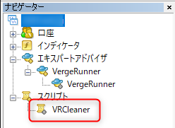
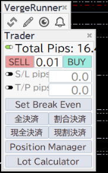
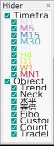
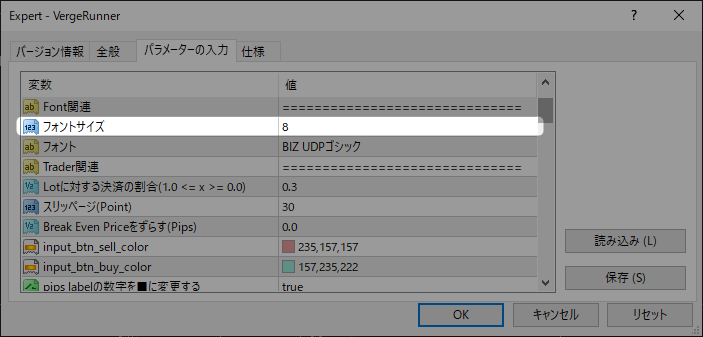

# ヘルプ

VergeRunnerを使用していて技術的な問題が発生した場合は以下の対処方法を参照して下さい。

## GUIが固まって動かない
EAを削除後、Script > **VRCleaner**をダブルクリックで実行して下さい。  
VergeRunnerに関連する一時データを削除し、クリーンな状態に戻します。

## 文字がはみ出している

PC環境によっては文字がはみ出てしまう可能性があります。
はみ出している方向によって以下の対処方法をご確認下さい。

### 横方向にはみ出している

文字列が長く、横方向にはみ出している場合は  
ウィンドウの右下をドラッグすると、ウィンドウが横に伸びはみ出しを解消できます。

<video src="../_video\resizable_window.mp4" controls="true" width="600"></video>

### 縦方向にはみ出している

文字サイズが大きい為、サイズを下げることで解消できます。  
EA設定の「Font関連 > フォントサイズ」に任意の文字サイズを入力し適切な大きさに調整をお願いします。

