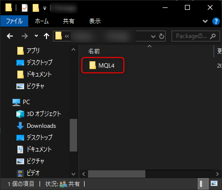
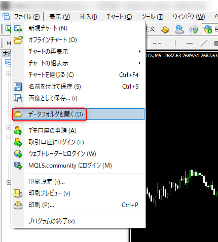
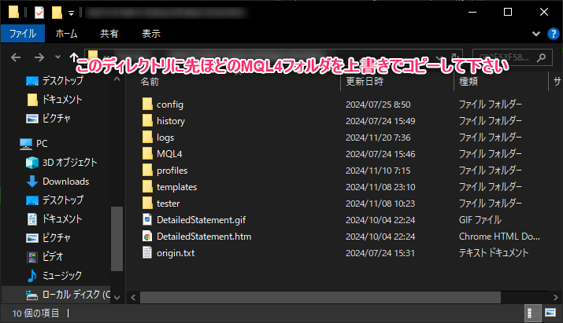
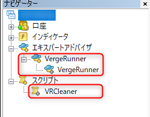

# インストール

## VergeRunner.zipの解凍

VergeRunner.zipを解凍します。  
解凍完了後、中に「MQL4」フォルダがあることをご確認下さい。

## VergeRunnerの配置

VergeRunnerフォルダを任意のMT4のExpertフォルダに配置します。

MT4を立ち上げ、ファイル > データフォルダを開く をクリック

エクスプローラーが開かれるので、このディレクトリに先ほどのMQL4フォルダを上書きでコピー

MT4を再起動するか、ナビケーターのエキスパートアドバイザーを右クリック > 更新を行い  
VergeRunnerが配置されていることを確認して下さい。

以上でインストール完了です。

---
[次のステップ | ライセンス認証](activation.md)