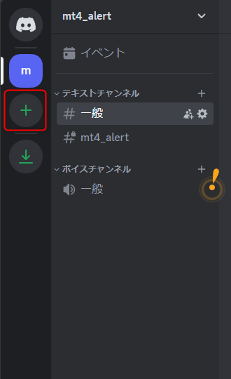
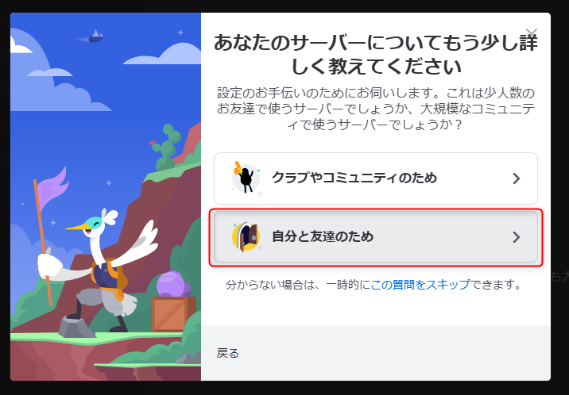
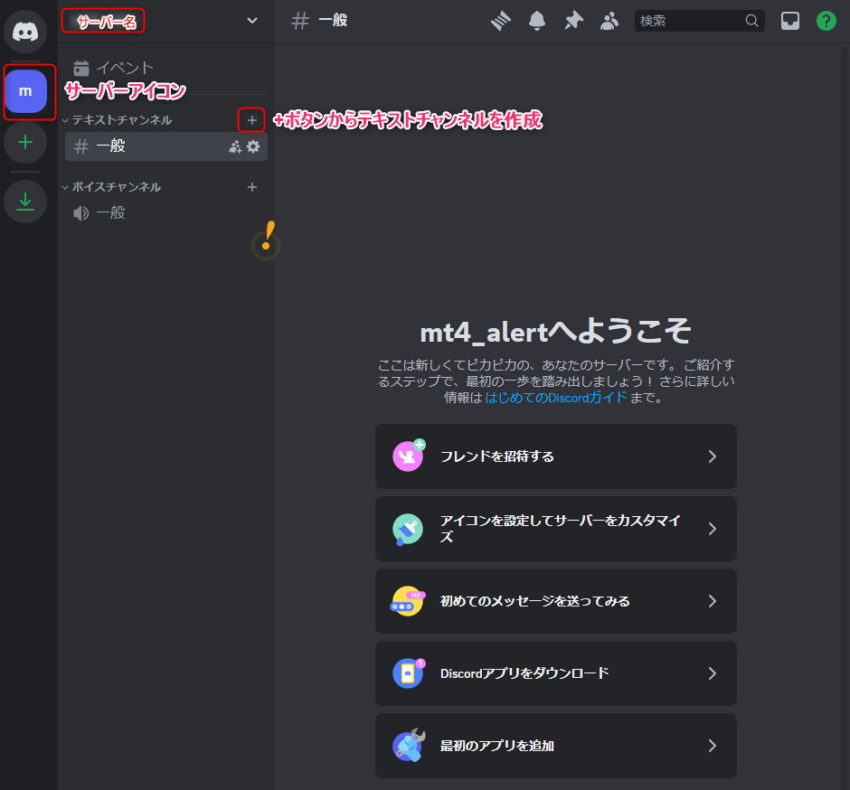
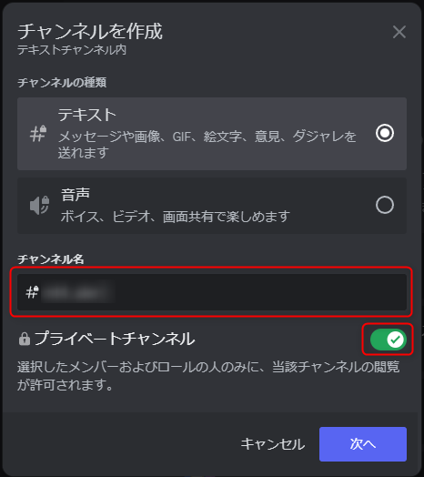
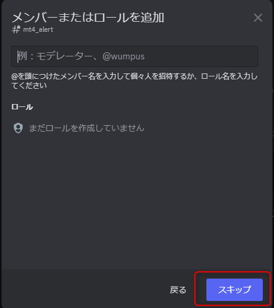
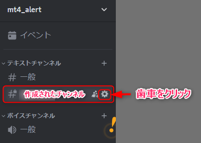
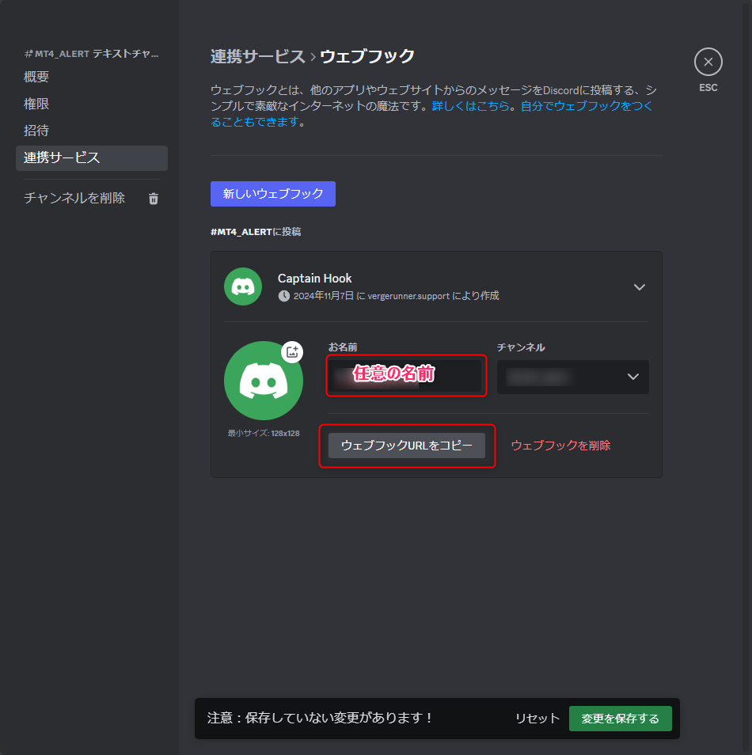
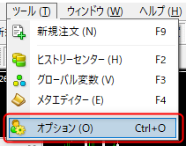
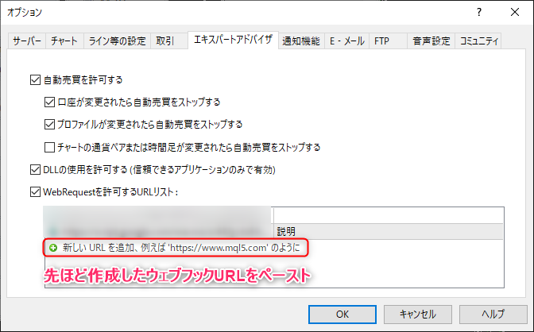

# Alert

AlertはAlert lineにRateがクロスしたタイミングでWebhookを利用し任意のメッセージを任意のプラットフォームに送信するツールです。

## 表示方法
VergeRunnerの一番右の画像をクリックするとAlertが表示されます。

## AlertSystemの構築
ここではDiscordを使用したAlert Systemの構築方法を記述します。

### Discordについて
Discordは、オンラインでのコミュニケーションを目的とした無料のプラットフォームです。主に音声通話、ビデオ通話、テキストチャットができ、画像や動画の共有も可能です。

サーバーというコミュニティを作成し、チャンネルで会話や通話を行います。ボットを追加して自動化やエンターテイメント機能も提供でき、役割や権限で管理もできます。ゲームのクランや趣味のグループ、ビジネスチームなど、さまざまな用途で利用されており、デスクトップ、モバイル、ブラウザで利用可能です。

### Discordのアカウントを作成
!!! info
    すでにアカウントを作成済みの方は"サーバーの作成"にお進み下さい

下記のURLからDiscordのアカウント作成画面に移動して下さい

`https://ptb.discord.com/register`

アカウント作成画面が表示されるので、必要な情報を入力後「はい」で次に進みます。

### サーバーの作成
ここからはサーバーの作成を行います。

「オリジナル」を選択してください

!!! info
    サーバー作成画面が表示されていない場合はホーム画面左の「+」ボタンをクリックすると表示されます

    

「自分と友達のため」を選択して下さい。

任意のサーバー名を入力後、新規作成ボタンを押して下さい。

「スキップ」を選択して下さい。

これでサーバーが作成できました。

### チャンネルの作成
ここからはチャンネルの作成を行います。

一つのサーバーの中でチャンネルは複数作成することができます。

テキストチャンネルの右にある「+」ボタンをクリックして作成画面に遷移して下さい。

作成画面が表示されましたら、任意のチャンネル名を入力。プライベートチャンネルにチェックを入れ「次へ」をクリックして下さい。

スキップをクリックして下さい。

これでチャンネルが作成できました。

### ウェブフックの作成

チャンネルの作成が完了しましたら、当該チャンネル横の歯車アイコンをクリックし設定画面へ遷移して下さい。

左側の「連携サービス」を選択し、「ウェブフックを作成」をクリックして下さい

初期ではCaptain_Hookというアカウントが用意されています。
このアカウントの名前を任意のものに変更して、「ウェブフックURLをコピー」をクリックして下さい

!!! warning
    ウェブフックURLは他者に利用されないようにご注意下さい。

### MT4でウェブフックを設定
MT4に移動しツールバーの「ツール > オブション」をクリックして、設定画面を表示して下さい

エキスパートアドバイザータブをクリック

WebRequesetを許可するURLリストに先ほど作成したウェブフックURLをペーストして「OK」ボタンをクリックして下さい

VergeRunnerの設定画面を表示します。
すでにチャートに配置されている場合はチャート右上の「VergeRunner」の文字をクリックすると表示されます。

「パラメータ入力」タブを選択

webhookの項目に先ほど作成したウェブフックURLをペーストして「OK」ボタンをクリックして下さい。

### 通知について
Discordはデスクトップアプリやスマートフォン向けのアプリが出ているので、そちらを導入されることをおすすめします。
スマートフォンアプリを入れて置くことで、PCから離れていても通知を受けることが可能になります。

!!! info
    デスクトップのDiscordアプリが立ち上がっている状態ですとスマホアプリへ通知が来ないので、スマホで通知を受け取りたい場合はデスクトップのDiscordアプリを落とした状態にして下さい。

!!! tips
    スマートウォッチなどのウェアラブルデバイスがあると、スマホを介して通知を受け取ることができるのでとっても便利です！

以上でAlertSystemの構築は完了です。

## Alertを設定する
Alertを追加するにはAlertウィンドウの「追加」ボタンをクリック後、チャートの任意の座標をクリックすると
Alert Lineが表示されます。

またAlert毎にリストにアイテムが作成されます。

### Alertの有効化
黄色の状態はまだAlertが有効化されていないことを意味します。
Alertウィンドウからラインに対応するアイテムの「有効化」ボタンをクリックすると緑色に変化します。
この状態でRateがAlert Lineと交差するとwebhookを利用して任意のプラットフォームにメッセージが送信されます。

### Alert Lineの再編集
有効化したラインは移動することができなくなっています。
ラインを修正したい場合は対応するアイテムの「無効化」ボタンをクリックすると再編集することができます。
その後「有効化」ボタンをクリックしますと、Alertが機能します。

### Alert Lineの削除
不要になったAlertは個別と全体で削除することができます。
個別で削除する場合は対応するアイテムの「削除」ボタンをクリックしてください

全てのAlert Lineを削除する場合はAlertウィンドウの「全削除」をクリックして下さい

## 注意事項
!!! warning
    AlertはMT4が起動されていて、VergeRunnerがチャートに配置されている状態に限ります。

    そのためMT4が落ちていたり、VergeRunnerが動作していない場合はAlertを設定していたとしても通知は発生しません。