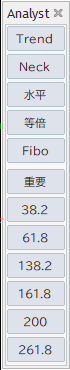
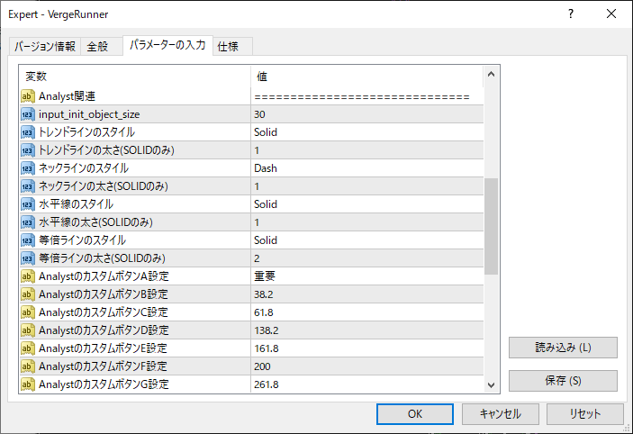
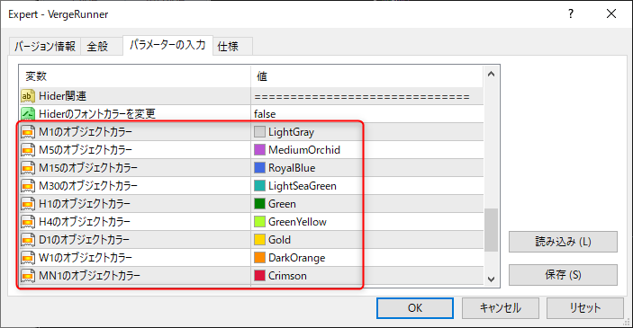

# Analyst

Analystはチャート分析を円滑にするツールの一つです。
チャートに対する描画をAnalystが担当し、表示非表示の管理をHiderが担当しています。

## 表示方法
VergeRunnerの左から２番目の画像をクリックするとAnalystが表示されます。

## 描画オブジェクトについて
Analystで描画できるオブジェクトの種類は以下の7種類になります

- Trend Line
- Neck Line
- 水平線
- 等倍線
- Fibonacci Retracement
- Custom(ラベル付きライン)
- カウントラベル

各オブジェクトは任意のスタイル、幅、文字列に変更することができます。
詳細はVergeRunnerの設定をご確認下さい。

## 描画する方法
Analystを介してオブジェクトを描画するには2つの方法があります。

### 当該ボタンをクリックする方法
Analyst GUIの当該ボタンをクリック後、チャートの任意の座標をクリックすることでオブジェクトが描画されます。

!!! info
    カウントラベルはボタンを実装していません

### ホットキーを使用する方法
あらかじめ設定されているホットキーを押下後、チャートの任意の座標をクリックすることでオブジェクトが描画されます。

[ホットキー一覧](../hotkeys.md)

## 時間軸毎に色をつける
描画した時間軸ごとにオブジェクトに色がつけられます。

### 色の設定
お好みの色を時間軸ごとに設定することができます。

## 注意事項
!!! Warning
    Analystを使用して描画したオブジェクトはHiderで管理をするために「説明」に情報を記述しています。
    その情報を改編してしまうと意図しない挙動が発生する恐れがあるため、ご注意下さい。