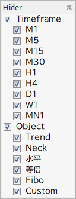
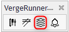
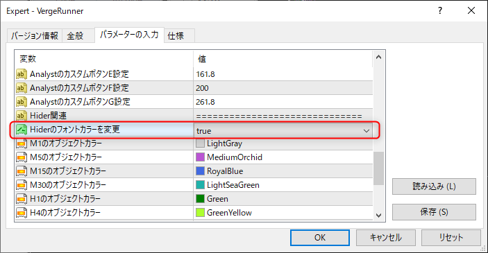

# Hider

Hiderはチャート分析を円滑にするツールの一つです。
チャートに対する描画をAnalystが担当し、表示非表示の管理をHiderが担当しています。

## 表示方法

VergeRunnerの右から2番目の画像をクリックするとHiderが表示されます。

## オブジェクトの表示非表示について
オブジェクトの表示非表示の管理にはTimeframeとObjectの２つのグループに分けております。

チェックが入っている状態が表示状態になります。
非表示にする場合はチェックボックスをクリックしてチェックを外すことで処理されます。

### 時間軸で表示を制御する
Analystで描画されたオブジェクトは描画された時間軸の情報を保持している為、
対応する時間軸のチェックボックスで表示を制御できます。
「Timeframe」チェックボックスは全ての時間軸に関するチェックボックスを一括制御することができます。

### オブジェクトの種類で表示を制御する
Analystで描画されたオブジェクトは描画されたオブジェクト種類の情報を保持している為、
対応するオブジェクトのチェックボックスで表示を制御できます。
「Object」チェックボックスは全てのオブジェクトに関するチェックボックスを一括制御することができます。

### 時間軸に対応する色を表示する
下記の設定Hiderの時間軸のラベルを対応する色に変更することができます。

## 注意事項
!!! Warning
    Hiderで制御可能なオブジェクトはAnalystで描画されたものに限ります。
    そのため、基本的にはMT4標準の描画ボタンを使用して作られたオブジェクトは管理対象外となります。

!!! tips
    オブジェクトの説明欄のタグを活用することで、MT4標準の描画ボタンを使用して作られたオブジェクトを管理対象にすることも可能です。
