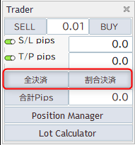
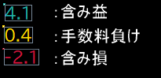
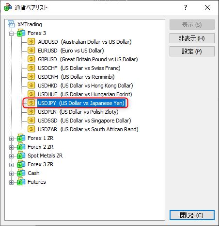

# Trader
トレーダーはエントリーやエグジットなどのポジションの管理をサポートするツールです。

## 起動方法

VergeRunnerのメインウィンドウの画像のボタンをクリックすると起動します。

### クイックエントリー

MT4の標準機能と同様にワンクリックでポジションを取ることができます。

SellボタンとBuyボタンの間にある数字はエントリーのLot数です。
最小値は0.01になります

### SL/TP

VergeRunnerのクイックエントリーを使用する際に適用されるSL/TPの設定です。

単位はPipsになります。

SL/TPの左側に位置するトグルボタンはエントリー時にSL/TPの適用をコントロールすることができます。
!!! info
    トグルボタンは緑色の状態が有効状態になります

### 全ポジションエグジット

現在保有する全てのポジションに対して約定処理を行います。
各ボタンをクリックすることで即座に処理が実行されます。

#### 全決済
全決済は所持中のポジションのLotを全て決済します。
#### 割合決済
割合決済は各ポジションのLotに対して設定された割合分のみを決済します。

初期値は0.5(50%)に設定されています。

例: 1.2Lotのポジションに対して割合決済(初期値0.5)をした場合は0.6Lot分が決済され、残りの0.6Lotは保持されたままになります。

##### 設定項目
割合決済の値はVergeRunnerの設定画面から変更できます。

初期値は0.5(Lotの半分を決済)

1.0はLotの全てを決済します。

### 合計Pips

ポジションを取りますと、各ポジション毎に現在の損益がPips単位でチャート上にラベルで表示されます。
複数通貨ペアをまたいで、ラベルの合計値が「合計Pips」に表示されます。

合計Pipsの値をリセットするにはポジションを全てエグジットしている状態で
Traderの「合計Pips ボタン」をクリックして下さい。

#### 各ポジションのPipsラベルについて

Pipsラベルには状態に応じた色が設定可能です。
以下は初期設定値での表示になります。

含み損

手数料負け

含み益

### PositionManager

Traderの「PositionManagerボタン」をクリックすることで表示されます。

PositionManagerはポジションを個別に管理するツールです。
ポジション毎に情報が表示され、全決済と割合決済が実行できます。

PositionManagerに表示されるアイテムは約定済みのもに限定される為、約定前の指値のポジションは表示されません。

### LotCalculator

Traderの「LotCalculatorボタン」をクリックすることで表示されます。

LotCalculatorは与えられた変数からLotを計算しTraderのクイックエントリーのLotとSL/TPに値をセットするツールです。

#### 使用する為の準備
LotCalculatorを使用するには証拠金の通貨と現在の通貨ペアの関係を把握する必要があります。

証拠金が円で現在の通貨ペアがXAUUSDの場合
決済通貨にJPYが無いのでUSDJPYを介して計算をします。
USDJPYの情報はMT4側で当該通貨が表示状態でないと取得できない為、MT4の通貨ペアの表示を設定します。

MT4ツールバーから表示 > 通貨ペアリスト をクリック

USDJPYが表示状態になっていることを確認して下さい。

非表示であれば表示状態に変更し閉じるボタンをクリックして下さい。

#### 使用方法

Lotの計算に必要な変数はLot計算ボタンの上に位置するものになります。
そのうちの「現在通貨ペア」「通貨量/Lot」は現在開いているチャートから自動的に入力されます。

全ての項目に入力が完了しましたら、「Lot計算」ボタンをクリックすると計算結果が表示されます。

##### 決済通貨ペア
決済通貨ペアは証拠金とトレード対象の通貨ペアからレートの変換を考慮して入力をします。

例:トレード通貨ペアがUSDJPY、証拠金が円の場合

決済通貨が証拠金の通貨と同一なので「決済通貨ペア」にはUSDJPYと入力します。

!!! warning
    このとき入力するシンボルは各証券会社が取り扱っている商品名と必ず同一にして下さい

例: トレード通貨ペアがGOLD.(XAUUSD)、証拠金が円の場合

決済通貨が証拠金の通貨と異なるのでUSDJPYを介して変換が必要になります。
なので決済通貨ペアにはUSDJPYと入力します。

##### S/L pips
pips単位の損失幅を設定します。
##### T/P pips
pips単位の利益幅を設定します。
##### 許容損失率(%)
証拠金に対する損失許容率を設定します。
##### Pos分割数
ポジションの分割数を設定します。
