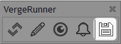
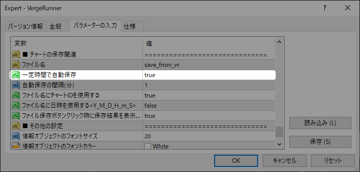
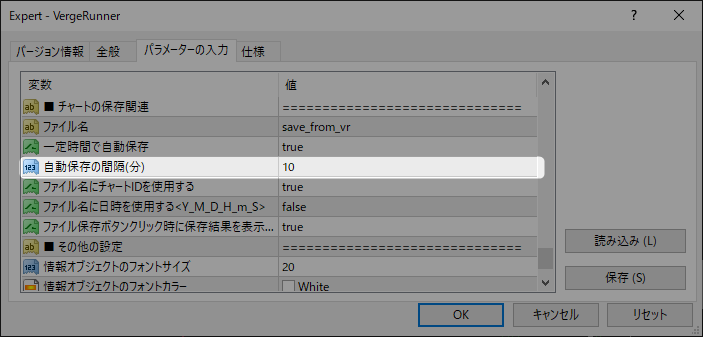
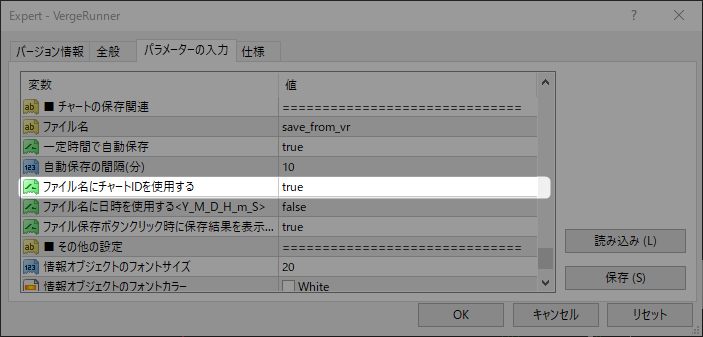
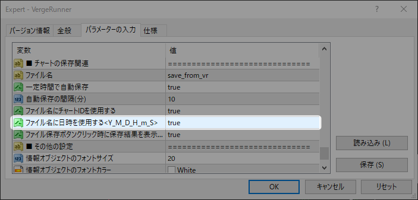

# チャートテンプレートの保存機能について

MT4標準機能である「定型として保存」をより使いやすくサポートする機能になります。  

## 保存方法

### 手動保存

手動で保存するにはVergeRunnerのフロッピーアイコンをクリックすると、即座に保存されます。

また`Shift + Ctrl + S`でも同様に保存が行えます。

### 自動保存

一定間隔で自動的に保存を行うことできます。  
突然のクラッシュや保存忘れ防止になるためおすすめです。  
EA設定を開き「チャートの保存関連 > 一定時間で自動保存」を**true**に設定すると自動保存が有効化されます。

自動保存の間隔は「自動保存の間隔(分)」で設定した時間になります。

## ファイル名について

ファイル名は以下の構成になっています。

`<prefix>_<symbol>.tpl`

prefix = EA設定の「ファイル名」  
symbol = 現在のチャートの通貨ペア

この設定ですと、同じ通貨ペアを複数のチャートで開いていた場合保存先が同一のファイルになります。  
チャート別にテンプレートを保存したい場合は「ファイル名にチャートIDを使用する」を**true**にします。

これにより、ファイル名にチャート固有のIDが含まれるため、チャート別に保存が行えます。  

ファイル名は以下の構成になります。  
`<prefix>_<symbol>_<chartID>.tpl`

更に同一のチャートで複数のテンプレートを保存したい場合は「ファイル名に日時を使用する」を**true**にします。

これにより`<Y_M_D_H_m_S>`の情報がファイル名に含まれる為、同一チャートで複数のチャートテンプレートを保存できます。  

ファイル名は以下の構成になります。  
`<prefix>_<symbol>_<chartID>_<datetime>.tpl`

